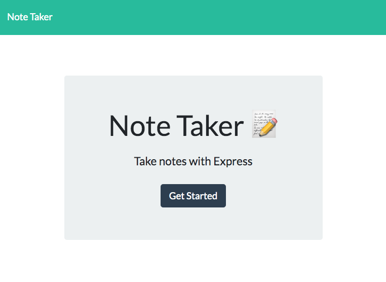
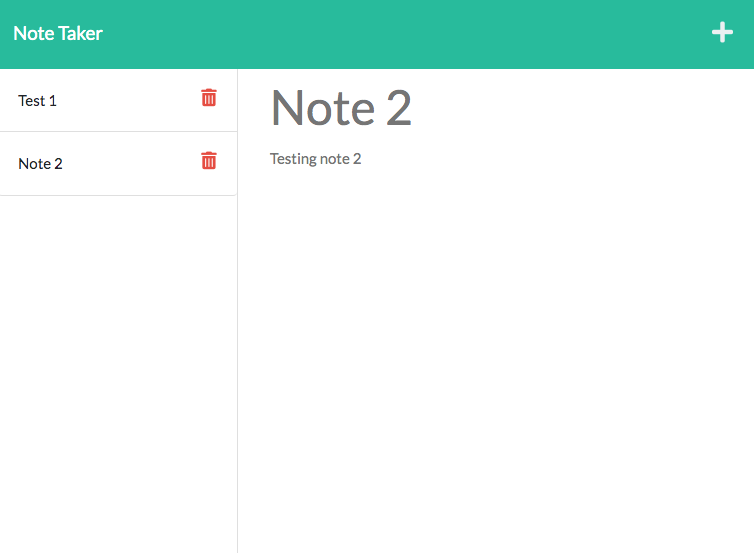

# Note_Taker

[Note Taker: Click to get started](https://notetakerhs.herokuapp.com/)

# Table of Contents

- [Description](#description)

- [Screenshots](#screenshots)

- [License](#license)

# Description

This app was created all the user to input, save and delete notes using Express.js

# Screenshots

# License

MIT
